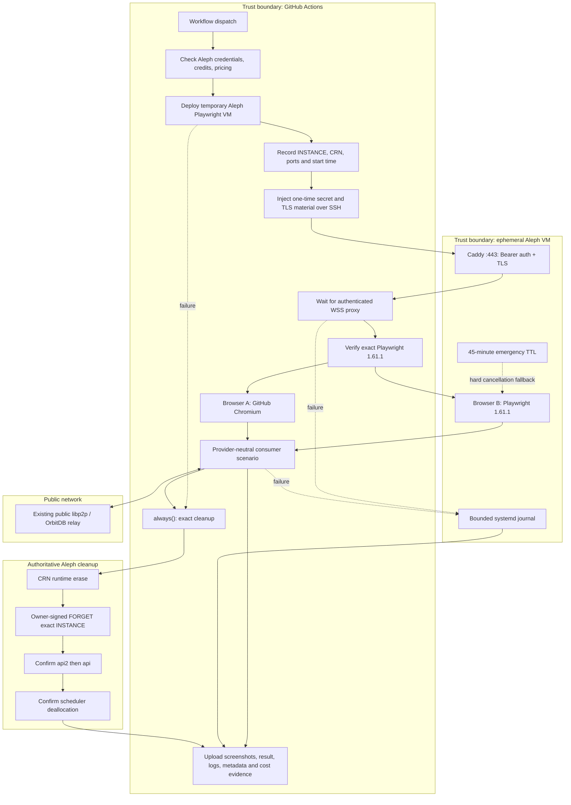

# Ephemeral Aleph Playwright runner

The runner provides a real second browser outside GitHub Actions without giving
the public internet an unauthenticated browser-execution endpoint. Browser A
runs on GitHub. Browser B runs in a temporary Aleph VM and connects to the same
consumer-owned scenario through Playwright's websocket protocol.

The consumer still owns its application assertions. `@le-space/playwright`
owns version verification, authenticated connection, portable evidence, and
the shared Aleph lifecycle contract.

## End-to-end lifecycle



The bearer secret is generated once per workflow, masked immediately, copied
only after boot, and never stored in the RootFS, logs, or artifacts. The TLS key
has the same lifetime. The VM's Playwright server listens only on loopback;
Caddy is the sole public entry point.

## VM image and post-boot provisioning

```mermaid
flowchart LR
  subgraph Build[RootFS build owner: relay-button]
    Debian[Debian cloud RootFS]
    Node[Install Node.js 24]
    PW[Install Playwright 1.61.1 + matching Chromium]
    Units[Install systemd units, Caddy and TTL]
    Manifest[Publish versioned manifest with Playwright contract]
    Debian --> Node --> PW --> Units --> Manifest
  end

  subgraph Allocate[Aleph infrastructure]
    Instance[INSTANCE with 2 vCPU / 4 GiB]
    Ports[Mapped SSH and TCP 443]
    CRN[Selected CRN]
    Manifest --> Instance --> CRN --> Ports
  end

  subgraph Bootstrap[GitHub post-boot owner]
    SSH[SSH with per-run key]
    Env[Write root-only environment file]
    Cert[Write per-run TLS certificate/key]
    Start[Start Playwright, proxy and TTL units]
    Probe[Authenticated /version probe]
    Connect[chromium.connect with Authorization header]
    Ports --> SSH --> Env
    SSH --> Cert
    Env --> Start
    Cert --> Start --> Probe --> Connect
  end

  subgraph Failure[Failure branches]
    Logs[Collect journal and service state]
    Cleanup["always(): erase + FORGET + verify"]
  end

  SSH -. failure .-> Logs --> Cleanup
  Probe -. mismatch / timeout .-> Logs
  Connect -. protocol failure .-> Logs
```



The image remains generic: it contains no repository checkout, Aleph private
key, bearer token, or reusable certificate. Post-boot SSH configures only the
ephemeral instance.

The maintained `Playwright Runner RootFS` workflow builds this exact contract.
Its `publish` and `deploy_vm` inputs default to `false`, so an ordinary dispatch
cannot incur Aleph cost. Publication and a validation deployment require an
explicit operator choice.

## Version and connection contract

The client calls the authenticated HTTPS `/version` endpoint before opening the
websocket. Both sides must report exactly `1.61.1`; a mismatch fails before
`chromium.connect()`.

```ts
import { chromium } from "@playwright/test";
import { connectAlephChromium } from "@le-space/playwright";

const browserB = await connectAlephChromium({
  chromium,
  wsEndpoint: process.env.ALEPH_PLAYWRIGHT_WS_ENDPOINT!,
  versionUrl: process.env.ALEPH_PLAYWRIGHT_VERSION_URL!,
  secret: process.env.ALEPH_PLAYWRIGHT_SECRET!,
});
```

Only `https://api2.aleph.im` followed by `https://api.aleph.im` is supported.
Caller configuration containing api3 or unrelated hosts is filtered.

## Cost evidence

Credit deployments have two different numbers that must not be conflated:

- **required credit capacity** is `unit credit requirement × compute units`;
- **net account credit delta** is the authoritative before/after observation.

The GitHub summary records pricing and balance API origins and timestamps,
hardware, compute units, runtime, required capacity, credits returned, credits
consumed, and the net delta. A balance delta is attributable to this test only
when the deployment account is not used concurrently. It is never replaced by
a time-pro-rated estimate.

## Cleanup and cancellation

Normal and failed jobs run exact-hash cleanup under `always()`:

1. request CRN runtime erase;
2. sign and broadcast FORGET as the INSTANCE owner;
3. confirm forgotten state on api2 and api;
4. confirm scheduler deallocation;
5. upload the cleanup evidence.

The guest TTL limits compute after a hard cancellation, but cannot sign FORGET.
A retention janitor must therefore scan uniquely named, expired runner
instances owned by its configured account, apply strict repository/run/attempt
and age guards, and clean only exact hashes. That janitor remains separate from
the consumer scenario.

The reusable `Playwright Runner Janitor` workflow requires an explicit
repository scope. It serializes runs per scope, rejects instances younger than
the configured TTL, and performs runtime erase, owner-signed FORGET, api2/api
confirmation, and scheduler-deallocation verification for every exact hash.
Consumers should schedule this workflow independently so it still runs after a
hard cancellation of their scenario workflow.

## Operational troubleshooting

- **WSS TLS error:** retain proxy/service logs and verify the per-run certificate
  covers the mapped hostname or address.
- **HTTP 401:** the bearer header is missing or differs from the injected secret.
- **Version mismatch:** rebuild or select the manifest matching the client.
- **Chromium launch failure:** inspect guest journal and confirm the manifest's
  browser/dependency version.
- **Cleanup disagreement:** do not reuse the display name; retry with the exact
  INSTANCE hash until both replicas and the scheduler agree.
- **Unexpected cost delta:** verify that no other workflow used the deployment
  account during the measured interval.
