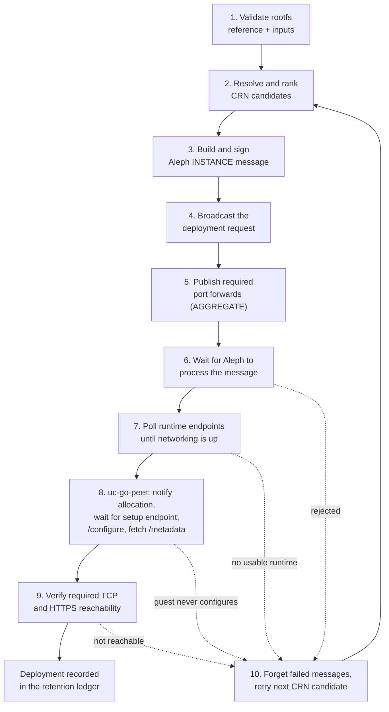
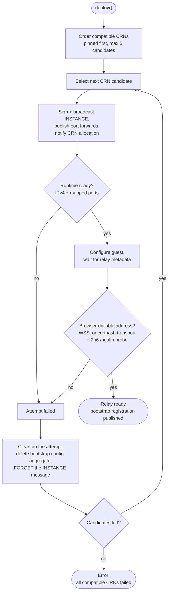

# Deployment Lifecycle

This page describes the current shared deployment flow implemented by
`@le-space/core` and `@le-space/node`.

## High-Level Flow

1. Validate the rootfs reference and deployment inputs.
2. Resolve or rank CRN candidates.
3. Build and sign the Aleph `INSTANCE` message.
4. Broadcast the deployment request.
5. Optionally publish required port forwards through an Aleph `AGGREGATE`.
6. Wait for Aleph to process the deployment message.
7. Poll runtime endpoints until networking becomes available.
8. For `uc-go-peer`, notify the CRN allocation, wait for the setup endpoint,
   run `/configure`, then fetch `/metadata`.
9. Verify required TCP and HTTPS reachability.
10. If deployment fails on a CRN, forget failed messages and retry the next
    candidate when appropriate.

As a picture — the happy path runs down the left, and every failure inside the
CRN attempt folds back into the retry loop described below:

## Shared Core Modules

- `manifests.ts`
  Manifest validation plus rootfs `STORE` existence and gateway probing.
- `crns.ts`
  CRN list fetching, compatibility filtering, geo enrichment, ranking, and
  preferred-country selection.
- `instance-deployment.ts`
  Aleph `INSTANCE` payload creation and message broadcasting.
- `aggregate-publication.ts`
  Port-forward aggregate publication.
- `deployment-inspection.ts`
  Aleph message polling and rejection diagnostics.
- `runtime.ts`
  Scheduler, execution-map, and runtime availability inspection.
- `guest.ts`
  `uc-go-peer` setup, metadata fetch, and reachability verification.
- `forget.ts`
  Cleanup of failed deployments.
- `retention.ts`
  Successful-deployment ledger maintenance and forgetting old resources.

## Retry Model

The current shared deploy executor supports:

- explicit `crn_hash` pinning
- preferred-country ranking
- multi-CRN retry when a deployment is rejected
- cleanup of failed deployment attempts before moving to the next CRN

Since `@le-space/ui` 0.6.40 the retry loop also enforces a
**browser-dialable-address invariant for every relay profile**: an
acknowledgement that carries no browser-dialable address (secure websocket
or certhash transport) throws inside the CRN loop, the failed attempt is
cleaned up (config aggregate, `INSTANCE` FORGET) and the next CRN is tried
— instead of reporting a deploy as successful that browsers can never
reach. The controller waits up to 10 minutes for the 2n6 hostname to
activate and probes `https://<2n6-host>/health` before declaring the relay
reachable. A single failed CRN attempt costs 7–13 minutes before failover
moves on; see [Relay dialability
timeline](../reference/relay-dialability-timeline.md) for the full
activation model and budget guidance.

This keeps the higher-level consumer workflows simpler because the retry
behavior now lives in shared code instead of repo-local scripts.

The browser loop in `packages/ui/src/shared/controller.ts` takes at most five
ordered candidates (a user-pinned CRN first, then the score-sorted compatible
ones) and treats "not browser-dialable" as a failed attempt rather than a
success:

The controller waits up to ten minutes per attempt for the 2n6 hostname to
activate, which is why a single failed candidate costs 7–13 minutes.

## `uc-go-peer` Guest Lifecycle

The current shared implementation includes the `uc-go-peer` operational flow:

1. deploy VM
2. wait for runtime networking
3. notify CRN allocation endpoint
4. wait for temporary setup endpoint
5. submit `/configure`
6. poll `/metadata`
7. verify relay ports and optional HTTPS proxy

That makes the shared repo more than a raw Aleph SDK. It already contains the
first app-profile lifecycle that UC needs today.

## Retention Flow

The shared retention logic stores a ledger under the Aleph aggregate key
`uc-go-peer-successful-deployments`.

Each successful record may include:

- `instance_item_hash`
- `rootfs_item_hash`
- `site_item_hash`
- `rootfs_cid`
- `site_url`
- `relay_peer_id`
- `rootfs_version`
- `vm_name`
- `deployed_at`

When the keep limit is exceeded, older Aleph hashes are collected and forgotten
through a shared `FORGET` message.
