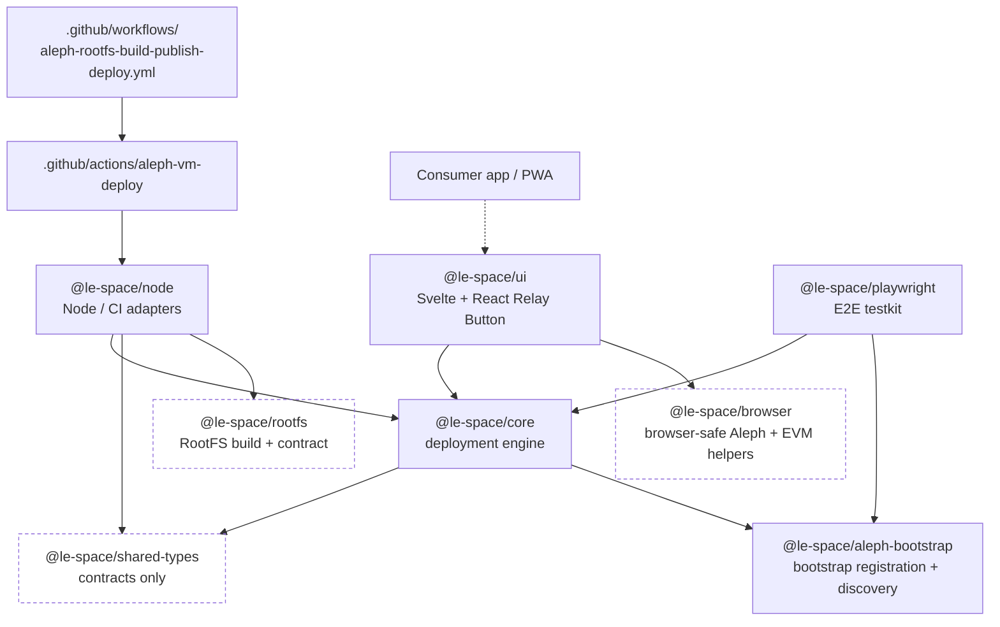

# Package Boundaries

The repository is split so the Aleph domain logic stays reusable while
environment-specific code lives in thin adapters.

Packages use the `@le-space/*` scope.

The arrows below are the actual workspace dependencies declared in each
`packages/*/package.json` — an arrow means "depends on". Note that `browser`
and `rootfs` are deliberately dependency-free leaves, and that nothing depends
on `ui` inside this repo: it is a published leaf for consumer apps.

`@le-space/browser` has no workspace dependencies today: it is a standalone
browser-safe layer that `@le-space/ui` composes with `@le-space/core`, rather
than a package layered on top of core. The intended *conceptual* layering
(`shared-types → core → browser → ui`) is about responsibility, not about the
import graph.

Two details the graph flattens: `@le-space/ui` additionally reaches into
`shared-types` and `browser` through relative source imports
(`../../../shared-types/src/…`) without declaring `shared-types` as a
dependency, and `@le-space/node` pulls in the libp2p/Helia stack on top of the
workspace packages shown above.

## `@le-space/shared-types`

This package should hold only shared contracts and value shapes.

Current examples:

- rootfs manifest types
- Aleph broadcast and deployment result types
- runtime inspection types
- aggregate content types

This package should not know about:

- `process.env`
- GitHub Actions files
- wallet SDKs
- HTTP request execution

## `@le-space/core`

This is the reusable deployment engine.

Current responsibilities:

- manifest validation
- rootfs Aleph `STORE` checks
- CRN discovery and ranking
- Aleph message creation and broadcast helpers
- deployment polling and rejection diagnostics
- runtime inspection
- `uc-go-peer` guest lifecycle helpers
- cleanup and retention logic

This package should depend on injected interfaces such as:

- `fetch`
- message signer
- content hasher
- optional network probes

This package should not directly depend on:

- GitHub Actions output files
- browser wallets
- CLI argument parsing

## `@le-space/aleph-bootstrap`

This package owns the Relay Button bootstrap namespace and the reusable helpers
around it.

Current responsibilities:

- relay bootstrap `POST` content shaping
- public multiaddr filtering
- Aleph `posts.json` bootstrap discovery queries
- libp2p bootstrap plugin composition from Aleph-backed multiaddrs

This package should not directly depend on:

- wallet-provider UX
- GitHub Actions environment parsing
- RootFS build assets

## `@le-space/node`

This package adapts the shared core for Node and GitHub Actions.

Current responsibilities:

- env parsing
- GitHub output and summary emission
- private-key signing with `ethers`
- deploy plan parsing
- deploy executor composition
- Aleph action runner entrypoint

This package is the correct place for:

- `process.env` access
- GitHub output formatting
- Node-specific crypto or wallet loading

## `@le-space/browser`

This package is the shared browser and PWA integration layer.

Current responsibilities:

- browser fetch composition
- Aleph API polling and result normalization
- typed browser client surface
- RootFS manifest load and resolution helpers
- pricing fetch helpers
- browser-safe EVM helpers:
  - `ethCall`
  - `sendTransaction`
  - `personalSign`
- browser-safe prepaid vault protocol helpers:
  - chain-id mapping
  - budget formatting
  - vault balance/reservation reads
  - vault transaction helpers

Keep local to apps for now:

- wallet-provider UX and account connection flow
- prepaid enforcement policy and warnings
- UI state and rendering

See also:

- [Browser reference](../reference/browser.md)
- [Examples And Real Integrations](./examples-and-integrations.md)

## `@le-space/ui`

This package is the shared UI layer built on top of the browser-safe helpers.

Current responsibilities:

- reusable React components
- reusable Svelte components
- shared presentation helpers for deployment state and relay setup
- Relay Button browser deployment UI integration

Keep local to apps for now:

- app-specific branding and layout
- product-specific copy and onboarding text
- project-local state orchestration that is not reusable across consumers

## `@le-space/rootfs`

This package owns reusable RootFS build and contract helpers.

Current responsibilities:

- manifest creation
- RootFS contract parsing
- execution planning
- reusable guest-script and reference asset packaging
- build and publish orchestration used by the Node runner

It is the right package for reusable RootFS-specific logic that should not live
inside consumer repositories.

## GitHub Action And Workflow Layers

The repo also contains two automation entrypoints outside `packages/`:

- `.github/actions/aleph-vm-deploy`
  Shared deploy action backed by `@le-space/node`.
- `.github/workflows/aleph-rootfs-build-publish-deploy.yml`
  Shared workflow entrypoint for RootFS build, publish, and deploy stages.

The action should stay thin. The reusable logic belongs in packages, not in
large YAML or shell blocks.
