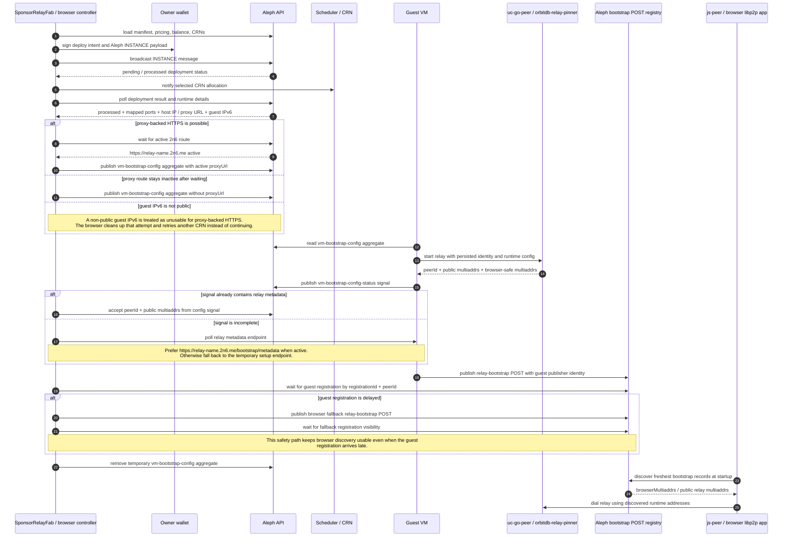
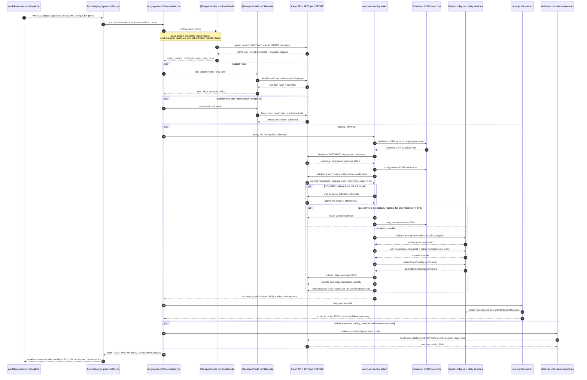
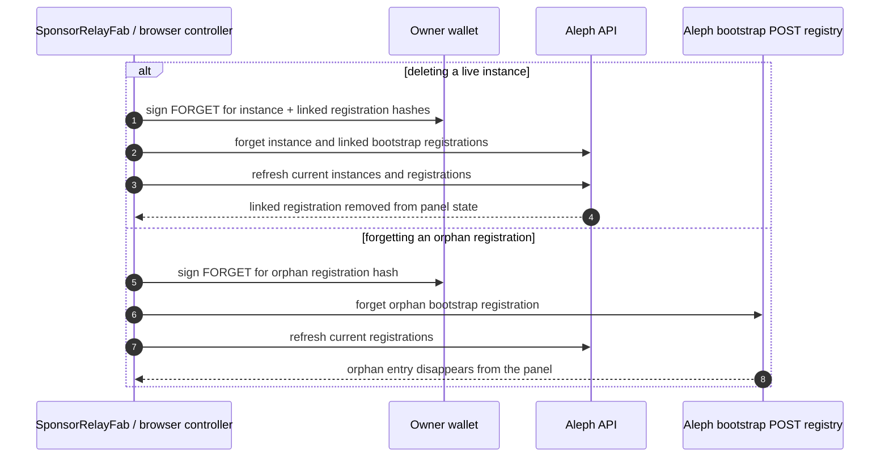

# Aleph Bootstrap Sequences

This page ties together the real implementation paths across:

- the browser Sponsor Relay UI
- the guest VM bootstrap publisher
- the reusable UC rootfs workflow
- the shared `@le-space/node` deploy and site runners

It is meant as a visual map for the parts that are easiest to lose track of:

1. who owns bootstrap publication at runtime
2. when CRN allocation and runtime checks happen
3. how the workflow, guest, and browser hand off responsibility

## Browser To Guest Bootstrap Ownership

The current target behavior is guest-owned runtime bootstrap publication.

The browser still orchestrates the deployment and waits for confirmation, but
the `uc-go-peer` handoff is now a multi-phase flow:

1. wait for usable runtime networking
2. wait for `2n6` activation when proxy-backed HTTPS is possible
3. publish `vm-bootstrap-config` into Aleph
4. wait for the guest config signal
5. confirm secure relay metadata
6. wait for the guest bootstrap registration
7. publish a browser fallback only when the guest registration stays delayed

### What This Means

- The owner wallet is still authoritative for deployment and authorization.
- The guest VM becomes authoritative for the runtime relay address set.
- Discovery clients should trust the newest guest-visible bootstrap state, not
  workflow-baked constants.

## Workflow, CRN, And VM Deployment Sequence

This is the high-level sequence for the UC workflow when a run is started with
`publish=true` and `deploy_vm=true`.

Unlike the browser `uc-go-peer` path, the workflow path still drives guest
configuration through the temporary mapped setup port. It then converges on the
same final bootstrap registration and Aleph visibility checks.

## Implementation Anchors

These diagrams are derived from the current implementation in:

- `universal-connectivity/.github/workflows/build-aleph-go-peer-rootfs.yml`
- `universal-connectivity/.github/workflows/uc-go-peer-rootfs-reusable.yml`
- `universal-connectivity/go-peer/aleph/README.md`
- `relay-button/packages/node/src/deploy-executor.ts`
- `relay-button/packages/ui/src/shared/controller.ts`
- `relay-button/packages/core/src/bootstrap-registration.ts`
- `relay-button/packages/core/src/bootstrap-config.ts`

## Practical Reading Guide

If you are debugging a broken rollout, read the system in this order:

1. rootfs publish and manifest outputs
2. site publish and final manifest URL selection
3. VM deploy and CRN allocation notification
4. runtime suitability checks for proxy-backed HTTPS, including public guest IPv6
5. guest configure handoff and relay metadata confirmation
6. guest bootstrap registration visibility on Aleph
7. browser fallback publication, if any
8. browser discovery and relay dial from the published registry state

## Delete And Orphan Cleanup

The registration lifecycle does not end at publish time. The Sponsor Relay UI
also cleans up linked and orphaned registrations explicitly.

