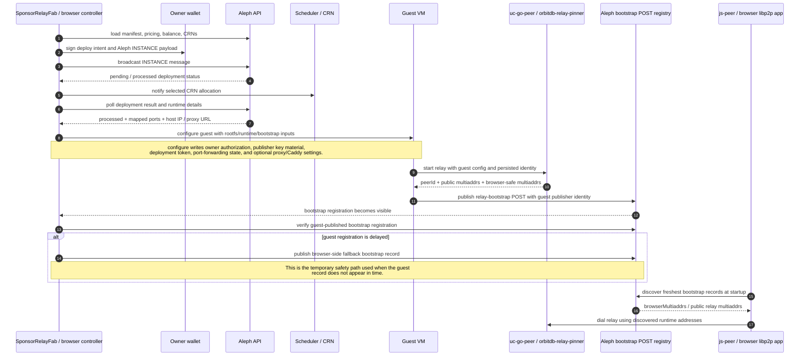
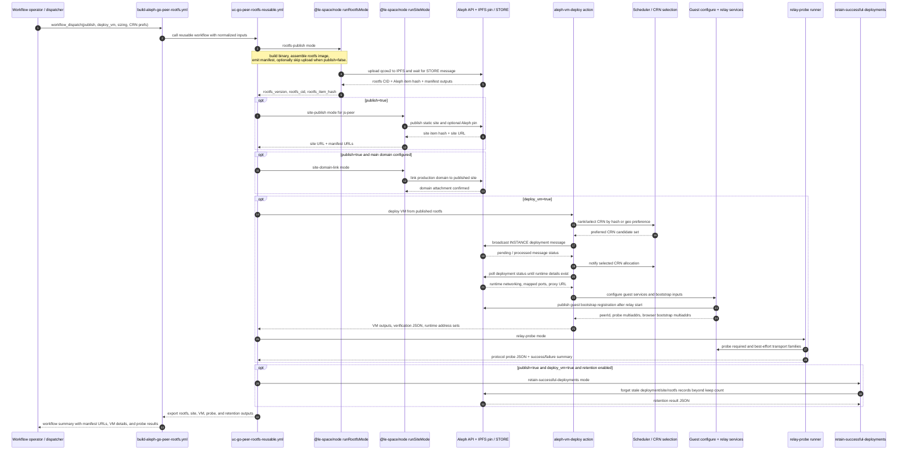

# Aleph Bootstrap Sequences

This page ties together the real implementation paths across:

- the browser Sponsor Relay UI
- the guest VM bootstrap publisher
- the reusable UC rootfs workflow
- the shared `@le-space/node` deploy and site runners

It is meant as a visual map for the parts that are easiest to lose track of:

1. who owns bootstrap publication at runtime
2. when CRN allocation and runtime checks happen
3. how the workflow, guest, and browser hand off responsibility

## Browser To Guest Bootstrap Ownership

The current target behavior is guest-owned runtime bootstrap publication.

The browser still orchestrates the deployment and waits for confirmation, but
the VM should publish the final relay bootstrap record with the relay-side
publisher identity after the guest has real runtime networking.

### What This Means

- The owner wallet is still authoritative for deployment and authorization.
- The guest VM becomes authoritative for the runtime relay address set.
- Discovery clients should trust the newest guest-visible bootstrap state, not
  workflow-baked constants.

## Workflow, CRN, And VM Deployment Sequence

This is the high-level sequence for the UC workflow when a run is started with
`publish=true` and `deploy_vm=true`.

## Implementation Anchors

These diagrams are derived from the current implementation in:

- `universal-connectivity/.github/workflows/build-aleph-go-peer-rootfs.yml`
- `universal-connectivity/.github/workflows/uc-go-peer-rootfs-reusable.yml`
- `universal-connectivity/go-peer/aleph/README.md`
- `shared-aleph-tooling/packages/node/src/deploy-executor.ts`
- `shared-aleph-tooling/packages/ui/src/shared/controller.ts`
- `shared-aleph-tooling/packages/core/src/bootstrap-registration.ts`
- `shared-aleph-tooling/packages/core/src/bootstrap-config.ts`

## Practical Reading Guide

If you are debugging a broken rollout, read the system in this order:

1. rootfs publish and manifest outputs
2. site publish and final manifest URL selection
3. VM deploy and CRN allocation notification
4. guest configure and relay runtime verification
5. guest bootstrap registration visibility on Aleph
6. browser discovery and relay dial from the published registry state
