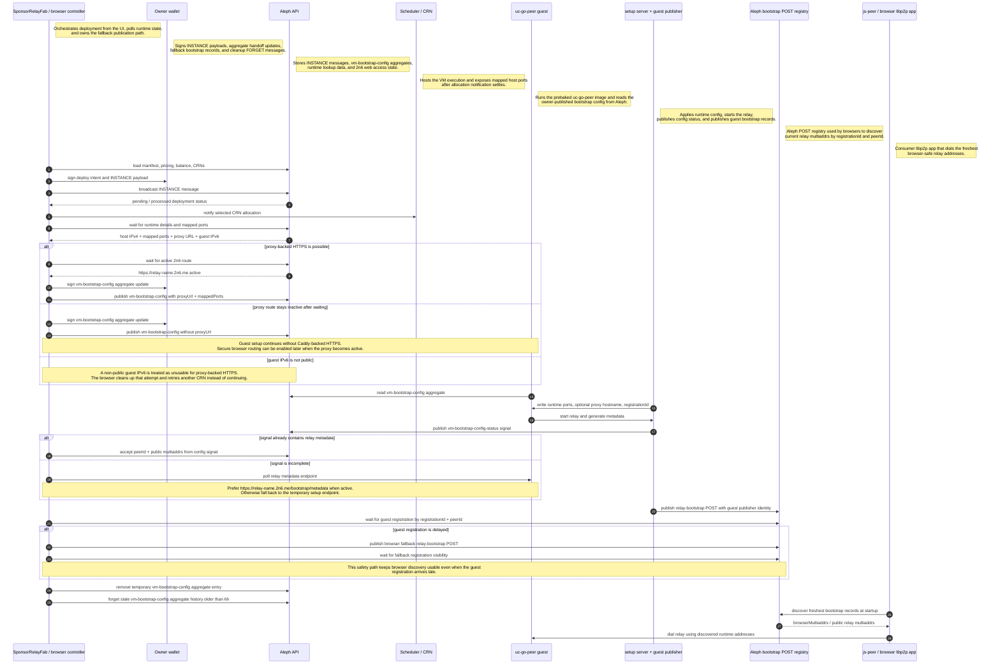
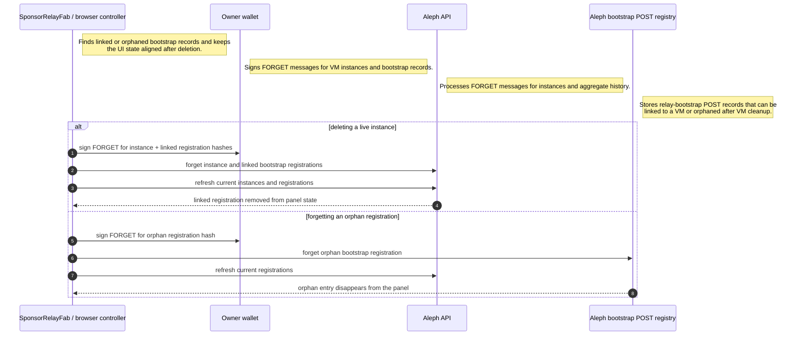

# Aleph Bootstrap Sequences

This page ties together the real implementation paths across:

- the browser Sponsor Relay UI
- the guest VM bootstrap publisher
- the reusable UC rootfs workflow
- the shared `@le-space/node` deploy and site runners

It is meant as a visual map for the parts that are easiest to lose track of:

1. who owns bootstrap publication at runtime
2. when CRN allocation and runtime checks happen
3. how the workflow, guest, and browser hand off responsibility
4. which profiles still use relay bootstrap posts versus direct service metadata

The current code now has three distinct handoff patterns:

- `uc-go-peer`
  Browser-orchestrated Aleph aggregate handoff plus guest-owned bootstrap publication.
- `orbitdb-relay`
  Direct guest `/configure` with preseeded publisher identity and owner authorization.
- `ucan-store`
  Bootstrap-package-driven service wiring with runtime metadata, not relay bootstrap posts.

## `uc-go-peer`: Browser To Guest Bootstrap Ownership

The current target behavior is still guest-owned runtime bootstrap publication,
but the browser handoff is now more explicit than the original flow.

The browser still orchestrates the deployment and waits for confirmation, but
the `uc-go-peer` handoff is now a multi-phase flow:

1. wait for usable runtime networking
2. wait for `2n6` activation when proxy-backed HTTPS is possible
3. publish `vm-bootstrap-config` into Aleph
4. wait for the guest config signal
5. confirm secure relay metadata
6. wait for the guest bootstrap registration
7. publish a browser fallback only when the guest registration stays delayed



### What This Means

- The owner wallet is still authoritative for deployment and authorization.
- The guest VM becomes authoritative for the runtime relay address set.
- Discovery clients should trust the newest guest-visible bootstrap state, not
  workflow-baked constants.

## `orbitdb-relay`: Direct Guest Configure With Preseeded Identity

The shared deploy runner now front-loads more of the bootstrap material for
`orbitdb-relay` than the earlier flow did.

Two implementation changes matter most here:

1. the deploy executor now derives or accepts a dedicated bootstrap publisher key
2. the first `/configure` call already carries the owner authorization, so the
   older second configure pass is only a fallback path now

This direct guest-configure path also keeps the new runtime checks for rootfs
visibility retries, CRN fallback, and proxy activation before guest setup.

```mermaid
sequenceDiagram
  autonumber
  participant Operator as CLI / GitHub Action operator
  participant Deploy as @le-space/node executeDeployPlan
  participant Aleph as Aleph API
  participant CRN as Scheduler / selected CRN
  participant Guest as orbitdb-relay setup endpoint
  participant Relay as orbitdb-relay service + refresh timer
  participant Registry as Aleph bootstrap POST registry

  Note right of Operator: Starts the CLI or action flow with rootfs,<br/>sizing, key, and CRN preference inputs.
  Note right of Deploy: Shared Node executor that signs deployment messages,<br/>selects CRNs, configures the guest, and publishes bootstrap records.
  Note right of Aleph: Accepts INSTANCE, AGGREGATE, POST, and FORGET messages;<br/>also exposes deployment processing and 2n6 state.
  Note right of CRN: Selected compute node that exposes the VM execution map<br/>and mapped ports used by the setup endpoint.
  Note right of Guest: Temporary HTTP setup service on port 80.<br/>It writes env files, Caddy config, and relay identity material.
  Note right of Relay: Long-running orbitdb-relay service plus refresh timer<br/>that republishes current relay metadata after startup.
  Note right of Registry: Bootstrap POST registry containing relay proof,<br/>owner authorization, and current public multiaddrs.

  Operator->>Deploy: deploy published orbitdb-relay rootfs
  Deploy->>Aleph: broadcast INSTANCE
  Aleph-->>Deploy: processed deployment message
  Deploy->>Aleph: publish required port-forward aggregate
  Deploy->>CRN: notify selected CRN allocation
  Deploy->>Aleph: wait for host IPv4, mapped ports, proxy URL, guest IPv6

  alt proxy URL reserved but still inactive
    Deploy->>Aleph: retry proxy activation checks before guest configure
  end

  alt runtime never exposes usable networking
    Deploy->>Aleph: forget failed instance attempt
    Deploy->>CRN: retry another compatible CRN
  else runtime is usable
    Deploy->>Guest: wait for temporary /health on mapped port 80
    Deploy->>Deploy: derive publisher EVM key and libp2p relay identity
    Deploy->>Deploy: precompute owner authorization for registrationId
    Note over Deploy,Guest: The owner authorization now rides in the first /configure call.<br/>The older no_start follow-up is only a fallback path.
    Deploy->>Guest: POST /configure with TCP/WS/metrics ports, proxy hostname, publisher key, libp2p identity, owner authorization
    Guest->>Relay: write runtime env, seed RELAY_PRIV_KEY, enable Caddy / AutoTLS, start relay
    Relay-->>Guest: peerId + public multiaddrs
    Deploy->>Guest: poll /metadata until peerId + public multiaddrs are ready
    Deploy->>Guest: run reachability verification
    Guest-->>Deploy: transports reachable
    Deploy->>Deploy: verify guest peerId matches preseeded publisher identity
    Deploy->>Registry: publish relay-bootstrap POST with relay proof + owner authorization
    Deploy->>Registry: wait for visible current registration
    Deploy->>Registry: reconcile owner registrations and forget stale records
    Relay->>Registry: bootstrap refresh timer republishes current metadata later
  end
```

## `ucan-store`: Bootstrap Package And Public Service Wiring

`ucan-store` now follows a different deployment contract from the relay
profiles:

- no relay bootstrap registry publication
- optional bootstrap package derivation from the Aleph private key
- service DID/origin validation inside the guest before the service is allowed
  to stay up
- runtime discovery through guest metadata and `/.well-known/ucan-store.json`

```mermaid
sequenceDiagram
  autonumber
  participant Operator as CLI / GitHub Action / Sponsor Relay UI
  participant Action as action-runner + deploy executor
  participant Aleph as Aleph API
  participant CRN as Scheduler / selected CRN
  participant Guest as ucan-store setup endpoint
  participant Service as upload API worker
  participant Guard as request guard + service manifest
  participant PWA as upload wall / generic PWA

  Note right of Operator: Starts deployment from CI, CLI, or UI and supplies<br/>service domain, admin DID, and bootstrap package inputs.
  Note right of Action: Derives optional UCAN bootstrap package data,<br/>deploys the VM, configures the guest, and emits metadata outputs.
  Note right of Aleph: Stores the VM INSTANCE and optional domain aggregate;<br/>no relay-bootstrap POST is expected for this profile.
  Note right of CRN: Hosts the upload service VM and exposes mapped setup,<br/>SSH, and HTTPS ports.
  Note right of Guest: Temporary setup endpoint that validates input,<br/>persists bootstrap material, writes env, and starts services.
  Note right of Service: Local ucan-store upload API worker on 127.0.0.1:8787<br/>with a persisted service signer.
  Note right of Guard: Local policy proxy on 127.0.0.1:8788.<br/>It narrows UCAN invocations and serves public discovery metadata.
  Note right of PWA: Runtime consumer that binds itself from the service<br/>manifest instead of relay bootstrap registry records.

  alt bootstrap mode is derive-from-aleph-private-key
    Action->>Action: derive admin DID, space DID, and root delegation proof from ALEPH_VM_PRIVATE_KEY
  end

  Operator->>Action: deploy published ucan-store rootfs
  Action->>Aleph: broadcast INSTANCE
  Aleph-->>Action: processed deployment message
  Action->>CRN: notify selected CRN allocation
  Action->>Aleph: wait for host IPv4, mapped ports, and proxy URL

  alt bootstrap package already fixes serviceOrigin
    Note over Action,Guest: Configure can proceed with the reserved proxy URL.<br/>The service does not need to wait for a fully active 2n6 route first.
  else serviceOrigin must come from the public hostname
    Action->>Aleph: retry proxy activation checks before guest configure
  end

  Action->>Guest: wait for temporary /health on mapped port 80
  Action->>Guest: POST /configure with proxyUrl, webauthnOrigin, adminDid, serviceDid/serviceOrigin, bootstrap_package
  Guest->>Guest: persist bootstrap package, write env, write Caddy config
  Guest->>Service: start local upload API worker
  Guest->>Service: probe did.json and revalidate runtime DID/origin against the bootstrap package
  Guest->>Guard: start request guard after validation succeeds
  Action->>Guest: poll /metadata until upload_service_did + VITE_UPLOAD_SERVICE_URL are ready
  Guest-->>Action: metadata includes bootstrap validation, proof validation, service manifest, PWA env

  opt instance custom domain configured
    Action->>Aleph: link instance domain to the VM
  end

  Note over Action,Aleph: No relay-bootstrap POST is published for ucan-store.
  PWA->>Guard: fetch /.well-known/ucan-store.json or /service-manifest.json
  Guard-->>PWA: runtime service DID/origin + delegation issuance policy
```

## Implementation Anchors

These diagrams are derived from the current implementation in:

- `relay-button/packages/node/src/deploy-executor.ts`
- `relay-button/packages/node/src/action-runner.ts`
- `relay-button/packages/node/src/ucan-store-bootstrap.ts`
- `relay-button/packages/ui/src/shared/controller.ts`
- `relay-button/packages/core/src/guest.ts`
- `relay-button/packages/core/src/bootstrap-registration.ts`
- `relay-button/packages/core/src/bootstrap-config.ts`
- `relay-button/packages/rootfs/reference/uc-go-peer/rootfs/uc-go-peer-bootstrap-refresh.py`
- `relay-button/packages/rootfs/reference/orbitdb-relay/rootfs/orbitdb-relay-bootstrap-refresh.py`
- `relay-button/packages/rootfs/reference/ucan-store/rootfs/ucan-store-configure.sh`
- `relay-button/packages/rootfs/reference/ucan-store/rootfs/ucan-store-service-start.sh`
- `relay-button/packages/rootfs/reference/ucan-store/rootfs/ucan-store-describe.py`

## Practical Reading Guide

If you are debugging a broken rollout, read the system in this order:

1. rootfs publish and manifest outputs
2. VM deploy and CRN allocation notification
3. runtime suitability checks for proxy-backed HTTPS, including public guest IPv6
4. guest configure handoff:
   `uc-go-peer` uses `vm-bootstrap-config`, `orbitdb-relay` uses direct `/configure`, `ucan-store` uses a bootstrap package
5. guest metadata confirmation:
   relay multiaddrs for `uc-go-peer` / `orbitdb-relay`, service DID and PWA env for `ucan-store`
6. relay bootstrap registration visibility on Aleph:
   required for `uc-go-peer` and `orbitdb-relay`, intentionally skipped for `ucan-store`
7. browser fallback publication and handoff cleanup, when the `uc-go-peer` guest registration is delayed
8. final discovery path:
   relay bootstrap registry for the relay profiles, `/.well-known/ucan-store.json` for `ucan-store`

## Delete And Orphan Cleanup

The registration lifecycle does not end at publish time. The Sponsor Relay UI
also cleans up linked and orphaned registrations explicitly.


