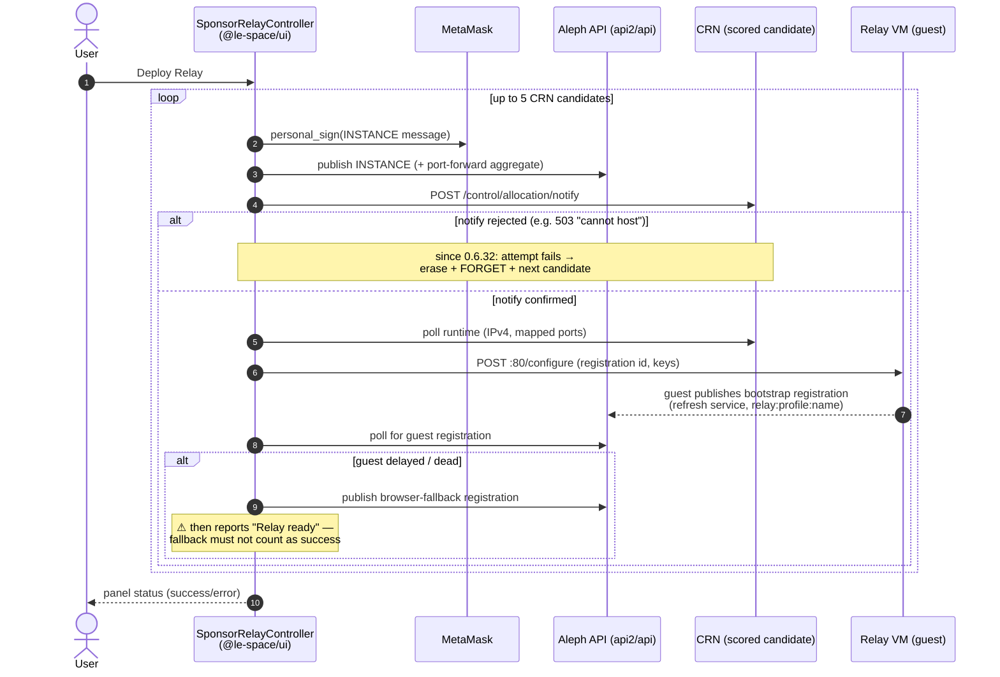
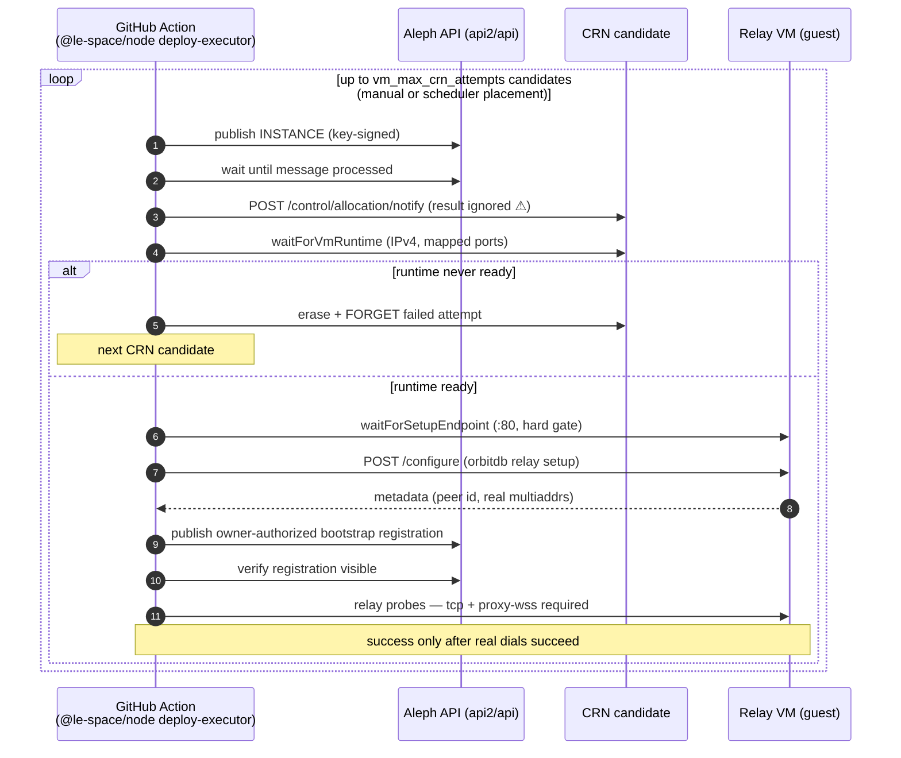
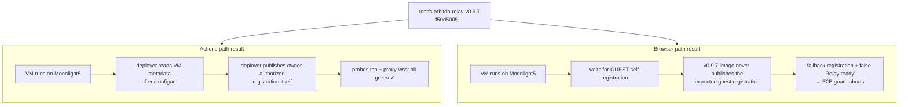

# Deployment paths: Browser UI vs. GitHub Actions

Relay Button ships two independent ways to provision an Aleph relay VM. Both
share the low-level building blocks in `@le-space/core` (instance message
creation, CRN scoring/notify, runtime inspection, FORGET/erase), but the
orchestration differs substantially — which explains why the Actions path has
historically been more reliable than the browser path.

| Aspect | Browser (`@le-space/ui` controller + `@le-space/browser`) | GitHub Actions (`@le-space/node` `deploy-executor`) |
| --- | --- | --- |
| Signing | MetaMask `personal_sign` per message (user interaction) | `ALEPH_PRIVATE_KEY` (non-interactive) |
| CRN selection | `filterDeployableCrns` (score-sorted crns-list snapshot), preferred CRN first, up to 5 candidates | Same scoring plus geo preference, `manual`/`scheduler` placement strategies, `vm_max_crn_attempts` |
| Allocation notify | Result was **discarded** until 0.6.32; now an unconfirmed notify fails the attempt and triggers CRN failover | Result still discarded (`.catch(() => null)`) — compensated by the runtime wait below |
| Runtime validation | `waitForVmRuntime` polls CRN for IPv4/ports | Same, but failure cleanly advances to the next CRN candidate |
| Guest configuration | HTTP `POST VM:80/configure`; failure degrades to a warning | `waitForSetupEndpoint` (hard gate) then `configureOrbitdbRelaySetup`; failure fails the attempt |
| Bootstrap registration | Waits for the guest; on delay **publishes a browser fallback registration and then reports "Relay ready"** — a dead guest looks green | Reads real metadata (peer id, multiaddrs) from the configured VM, publishes an owner-authorized registration, verifies visibility on Aleph |
| Reachability validation | None — no dial test before success | **Required relay probes** (`tcp`, `proxy-wss`; best-effort `webrtc-direct`) — success means the relay was actually dialed |
| Cleanup of failed attempts | Erase + FORGET + verify (since 0.6.30/0.6.32 fixes) | Erase + FORGET + verify, plus retention of the last N successful deployments |

## Sequence: Browser path (Sponsor Relay UI)

## Sequence: GitHub Actions path (deploy-executor)

## Why the Actions path "just works" more often

1. **No success lie.** The Actions path derives the bootstrap registration
   from metadata served by the configured VM itself and then dials the relay
   (`tcp`, `proxy-wss` required). The browser path can publish a predicted
   fallback registration for a VM that never booted and still report
   "Relay ready" (observed in simple-todo E2E runs #37–#42).
2. **Hard gates instead of warnings.** `waitForSetupEndpoint` and a failed
   `/configure` abort the attempt in the Actions path; the browser treats the
   equivalent situations as recoverable warnings.
3. **Failover maturity.** `vm_max_crn_attempts` existed in the Actions path
   long before the browser gained working failover in 0.6.32 (the browser
   discarded the allocation-notify result until then, so a full CRN —
   NodeCity3 at capacity, HTTP 503 — silently produced ghost deployments).

## A/B evidence: same image, same CRN, two outcomes (2026-07-19)

orbitdb-relay run [29696456560](https://github.com/NiKrause/orbitdb-relay/actions/runs/29696456560)
deployed the exact rootfs (`orbitdb-relay-v0.9.7`, `f50d5005…`) that the
browser E2E had been failing with — after 3 CRN attempts it landed on
Free To Link Moonlight5 (host 62.141.40.252, the same CRN/host where the
browser-path guest had appeared dead in simple-todo runs #37–#42) and
**every probe passed**. The infrastructure is fine; the difference is who
publishes the bootstrap registration:

Conclusion: the guest self-registration services that the 0.6.30+ browser
controller waits for (deregister service, reworked refresh) exist in the git
tree but **were never built into a published rootfs image** — the deployed
v0.9.7 image predates them. The Actions path never depended on guest
self-registration (the deployer publishes from real VM metadata), which is
why it keeps working. Two remedies, not mutually exclusive:

1. Short term: make the browser controller publish the final registration
   from real VM metadata after a confirmed `/configure` (same as the Actions
   path) instead of treating that as a degraded "fallback".
2. Long term: build + publish a new rootfs image containing the guest
   self-registration services, then update consumer manifests.

## Known gaps (both paths)

- `notifyCrnAllocationWithRetry` results are still ignored in
  `deploy-executor` (`.catch(() => null)`); the runtime wait compensates, but
  adopting the 0.6.32 browser behavior (fail the attempt on an unconfirmed
  notify) would save one full runtime-wait cycle per rejected CRN.
- The browser fallback registration should never satisfy the "Relay ready"
  condition; consumers (e.g. the simple-todo E2E guard) currently have to
  detect it themselves via the publisher address.
- Neither path health-checks a CRN before selecting it; a CRN with broken
  Aleph endpoints (e.g. responses referencing retired `official.aleph.cloud`
  hosts) is only discovered after a deploy attempt.
