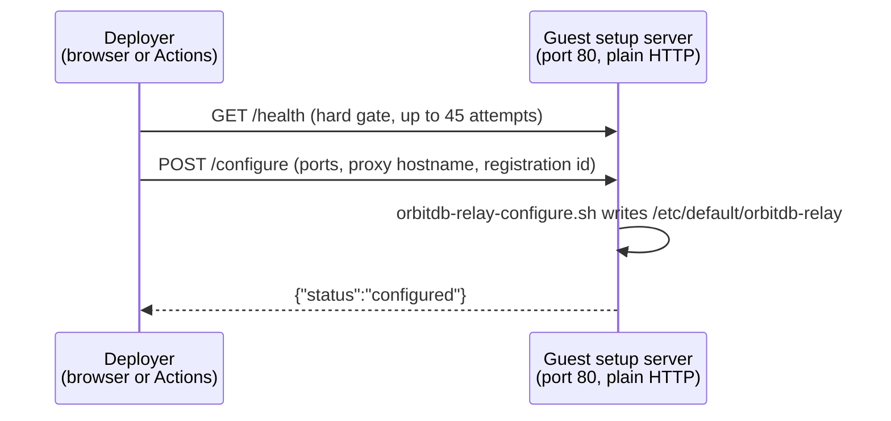

# Guest configuration handoff

A freshly deployed VM boots without knowing anything about its own
deployment: the Aleph CRN assigns host ports only at allocation time, and the
2n6 proxy hostname is decided even later. Something has to tell the guest.

There are **two ways** that happens, and the difference decides whether a
deployment can be started from an HTTPS page at all.

## The setup endpoint is plain HTTP on purpose

The rootfs exposes a temporary setup server on **guest port 80** (mapped to
some CRN host port). It answers `GET /health`, `GET /metadata` and
`POST /configure`, and it shuts down once the relay is configured.

Port 80 is *plain HTTP by design*: Caddy serves HTTPS on 443, but Caddy can
only be configured **after** it learns its proxy hostname — which arrives in
that very `/configure` call. The endpoint therefore exists precisely in the
window before TLS does, and it cannot be secured retroactively.

Everything below follows from that one fact.

## Handoff A — push (browser or CI posts to the guest)



Used by every image that does **not** declare
`supportsBootstrapConfigAggregate` in its rootfs manifest.

:::danger A HTTPS origin can never complete this handoff
Both requests target `http://<vm-ip>:<port>/…`. A page served over HTTPS is
blocked from making them — the browser refuses the request as **mixed
content**:

```
Mixed Content: The page at 'https://example.org/' was loaded over HTTPS,
but requested an insecure resource 'http://37.114.50.44:35955/health'.
This request has been blocked; the content must be served over HTTPS.
```

Because the `/health` probe is a hard gate, the attempt then fails, is
cleaned up (CRN erase + Aleph `FORGET`), and the controller moves to the next
CRN candidate — repeating until all candidates (capped at **5**) are
exhausted, ending in `All compatible CRNs failed.`

The UI now detects this up front and fails immediately with an actionable
message instead of burning five deployments.
:::

## Handoff B — pull (guest fetches its own config)

```mermaid
sequenceDiagram
    participant D as Deployer
    participant API as Aleph API (HTTPS)
    participant VM as Guest setup server
    D->>API: publish INSTANCE (SSH key carries<br/>aleph-bootstrap-config:&lt;owner&gt;:&lt;token&gt;)
    D->>API: publish VM bootstrap config aggregate
    VM->>VM: read deployment token from own authorized_keys
    VM->>API: fetch aggregate by (owner, token)
    VM->>VM: apply config, generate metadata
    VM->>API: publish signed acknowledgement signal
    D->>API: poll for the signal (40 × 3 s)
```

No request ever travels from the deployer to the guest, so mixed content
cannot occur and an HTTPS origin works normally.

The acknowledgement is **not optional**: the controller waits on it and fails
the attempt if it does not appear.

### Declaring support

A rootfs image opts in through its generated manifest:

```json
{
  "profile": "uc-go-peer",
  "supportsBootstrapConfigAggregate": true
}
```

The flag must only be set by images that really implement the guest-side
fetch. Announcing it early is worse than not announcing it: the deployer
would publish the aggregate and then block for two minutes waiting for an
acknowledgement that never comes.

| Profile | Handoff |
| --- | --- |
| `uc-go-peer` | pull |
| `orbitdb-relay` | pull |

:::note Known gap: the aggregate carries no owner authorization
The controller does not populate `bootstrap.ownerAuthorizationBase64` in the
record, for either profile. The guest therefore publishes its registration
without one, which leaves it in `wallet-signed` trust mode rather than
`dual-key-attested`. Connectivity is unaffected — this only lowers the
attestation level, and it is pre-existing behaviour, not a regression of the
pull handoff.
:::

## What may cross the setup endpoint

Because the channel is unencrypted and the aggregate is **publicly
readable**, the rule is simply: *no secrets in either place*.

| Value | Allowed | Why |
| --- | --- | --- |
| Ports, public IPs, proxy hostname | ✅ | Public deployment facts |
| `bootstrap_registration_id`, owner address | ✅ | Public identifiers |
| `bootstrap_owner_authorization_b64` | ✅ | A *signed authorization*, not a key |
| Owner private key | ❌ | Never accepted — the endpoint rejects the field |
| Bootstrap publisher private key | ⚠️ | Generated on the guest when not supplied |

Two consequences worth knowing:

- **The guest generates its own bootstrap publisher key.**
  `orbitdb-relay-configure.sh` creates one (`openssl rand -hex 32`) when the
  deployer does not supply it, and reuses an already-provisioned key so the
  relay keeps its identity across reconfigurations. The key that signs the
  relay's own Aleph registrations therefore never has to leave the VM.
- **The owner only ever hands over a signed authorization**, never the key
  behind it. The `/configure` payload no longer has a field for it.

:::caution Still outstanding on the Actions path
`deploy-executor` still sends two secrets to the setup endpoint:
`bootstrapPublisherPrivateKey`, and the libp2p identity that seeds
`RELAY_PRIV_KEY` (also a private key). The publisher key is
`HMAC-SHA256(deployWalletKey, …)`, so the wallet key itself is not exposed,
but the value is **deterministic and long-lived** — identical for every
deployment with the same wallet and profile.

Three things depend on that transfer, and they have to be unpicked together:

1. **Deterministic peerId.** The executor predicts the relay's peerId before
   the VM boots, publishes the registration early, and later asserts the
   guest reports the same peerId. Dropping the prediction means reading
   `metadata.peer_id` instead — which the executor already does, it currently
   only compares the two. The no-prediction path also already exists: when
   `publisherDerivedRelayIdentity` is absent, a second `/configure` pass
   signs the owner authorization against the real metadata.
2. **A shared publisher identity.** The executor publishes the registration
   itself, signing with the same key it hands the guest. If the guest
   generates its own key instead, the runner's registration and the guest's
   periodic refresh are published by *two different addresses*.
3. **Binding the authorization.** An owner authorization commits to a
   specific `publisherAddress` and `peerId`, so it can only be signed once
   both are known.

The resolution is the `uc-go-peer` shape: let the guest own the publishing
identity, have the runner *authorize* rather than publish. `describe.py` now
reports `bootstrap_publisher_address` for exactly that purpose — it is the
piece that was missing, since the deployer otherwise has no way to learn the
address of a key the guest generated.
:::

## Why the E2E suite does not catch mixed-content regressions

The Playwright suite serves the app from `http://localhost:4173`
(`playwright.config.js` → `baseURL`). Mixed content is by definition *an
HTTPS page loading HTTP subresources*, so on an HTTP page the rule never
applies and `http://<vm-ip>:<port>/health` is an ordinary same-scheme
request.

Nothing is disabled to achieve this — there is no `ignoreHTTPSErrors`, no
`bypassCSP`, no `--disable-web-security`. Chromium enforces the rule exactly
as in production; the precondition is simply absent.

**Consequence:** every browser-path deployment test runs on an origin that is
structurally immune to this failure class, while every real deployment runs
on HTTPS. Covering it requires at least one test against an HTTPS origin.

## See also

- [Deployment paths: Browser UI vs. GitHub Actions](./deployment-paths.md)
- [Rootfs contract](./rootfs-contract.md)
