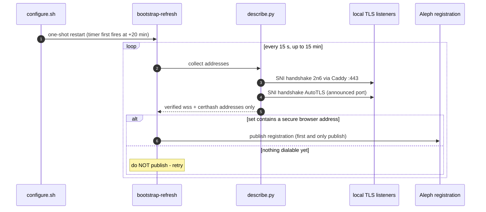

# Relay dialability timeline

A freshly provisioned relay VM does not become browser-dialable all at once.
Each browser-facing transport has its own activation chain, and several of
them depend on external systems (DNS propagation, Let's Encrypt) whose
latency varies per VM and per load. This page shows **what becomes dialable
when**, which guarantees the guest gives before advertising an address, and
how the controller reacts when a path never activates.

## The three browser paths

| Path | Transport | Certificate | Ready after | Profiles |
|---|---|---|---|---|
| **certhash** | webtransport / webrtc-direct | self-generated, hash embedded in the multiaddr — no ACME | **seconds** (peer startup) | `uc-go-peer` (go-libp2p) |
| **2n6 proxy** | `/dns4/<name>.2n6.me/tcp/443/tls/ws` via local Caddy | Let's Encrypt, **TLS-ALPN-01** on :443 | 2n6 DNS propagation (≈30 s–10 min under load) **+** ACME (≈45 s) | `orbitdb-relay`, `uc-go-peer` |
| **AutoTLS** | `*.libp2p.direct` `tls/ws` | Let's Encrypt via p2p-forge | zone acquisition + ACME; needs AutoNAT/DHT | both (unreliable when DHT is disabled) |

```mermaid
gantt
  dateFormat  s
  axisFormat  %M:%S
  title Typical activation timeline of a fresh relay VM (worst-case 2n6 latency)
  section VM
  Boot + runtime networking            :a1, 0, 150s
  Guest config handoff (push or pull)  :a2, after a1, 30s
  Relay service up                     :a3, after a2, 15s
  section certhash (go peer)
  webtransport + webrtc-direct dialable :crit, b1, after a3, 10s
  section 2n6 + Caddy
  2n6 DNS propagation                  :c1, after a2, 360s
  ACME TLS-ALPN-01 issuance            :c2, after c1, 45s
  2n6 wss dialable                     :crit, c3, after c2, 5s
  section Registration
  publish retry loop (15 s cadence)    :d1, after a3, 420s
  registration carries dialable addr   :crit, d2, after c3, 10s
```

The critical property: **the earliest dialable path defines when consumers
can connect** — for go peers that is certhash within seconds; for
`orbitdb-relay` (no certhash transports) it is the 2n6 path, so worst-case
several minutes.

## Guarantees the guest gives (v0.6.41 / v0.6.42)

The guest scripts enforce two invariants before anything reaches the Aleph
bootstrap registration:

1. **No wss address is advertised before its certificate serves**
   ([#74](https://github.com/NiKrause/relay-button/pull/74), ported to
   `uc-go-peer` in [#77](https://github.com/NiKrause/relay-button/pull/77)).
   `describe.py` performs a CA-validated TLS-SNI handshake against the local
   listener — 2n6 against Caddy on `127.0.0.1:443`, AutoTLS against the
   announced port — and drops addresses that fail it. certhash addresses are
   exempt: the hash in the multiaddr *is* the authentication, no ACME is
   involved.
2. **No registration is published without a browser-dialable address**
   ([#75](https://github.com/NiKrause/relay-button/pull/75)). The initial
   publish retries every 15 s for up to 15 min and only publishes once the
   address set contains a secure browser address (`tls/ws`, `wss`, or
   certhash-bearing webtransport/webrtc-direct — plain `/ws` does not count,
   an HTTPS page cannot dial it). Intermediate address-less registrations
   are never published, because consumers would resolve too early and fail.
   After the deadline, whatever exists is published so the Actions probe
   path keeps working.

## What the controller does meanwhile (`@le-space/ui` ≥ 0.6.40)

- Waits up to **10 minutes** for the 2n6 hostname to activate (the
  activation latency varies with 2n6 service load).
- Applies the **browser-dialable-address invariant to every relay profile**:
  an acknowledgement without a dialable browser address throws inside the
  CRN loop → the failed attempt is cleaned up (config aggregate, INSTANCE
  FORGET) → the next CRN is tried.
- Probes `https://<2n6-host>/health` before declaring the relay reachable.

A single failed CRN attempt costs **7–13 minutes** (VM boot + config-ack
wait + activation wait) before failover moves on. E2E suites driving real
provisioning must budget for chains of them — the reference suite uses
35 min provision / 50 min test / 60 min job.

## Failure signatures and what they meant

These are the historical failure modes, all fixed as of v0.6.42 — kept here
because their signatures are the fastest way to recognise a regression:

| Signature | Cause | Fixed by |
|---|---|---|
| `net::ERR_SSL_PROTOCOL_ERROR` on every wss dial, cert never issues | Caddy ACME forced onto HTTP-01 while nothing serves :80 after setup | [#71](https://github.com/NiKrause/relay-button/pull/71) — TLS-ALPN-01 on :443. **Never flip the Caddyfile issuer back** (that was `b8b8c53`). |
| Same SSL errors, but only on *some* VMs; registration has only `libp2p.direct` addresses | ACME race: AutoTLS multiaddrs appeared before their cert served, describe broke its wait on mere presence | [#74](https://github.com/NiKrause/relay-button/pull/74) / [#77](https://github.com/NiKrause/relay-button/pull/77) — symmetric cert gate |
| `Relay did not advertise an authenticated browser-dialable address` | One-shot registration publish raced the 2n6 DNS propagation; 16-minute dead zone until the refresh timer | [#75](https://github.com/NiKrause/relay-button/pull/75) — publish retry loop |
| Provisioning timeout right after `Retrying on next CRN` | Failover works, but the test budget only fits ~1.5 attempts | widened E2E budgets (35/50/60 min) |

## See also

- [Guest configuration handoff](./guest-configuration-handoff.md) — how the
  config reaches the VM (push vs pull) and why the setup endpoint is HTTP.
- [Aleph bootstrap sequences](./aleph-bootstrap-sequences.md) — message-level
  view of the registration lifecycle.
- [Deployment lifecycle](../architecture/deployment-lifecycle.md) — the
  controller-side deploy flow and retry model.
